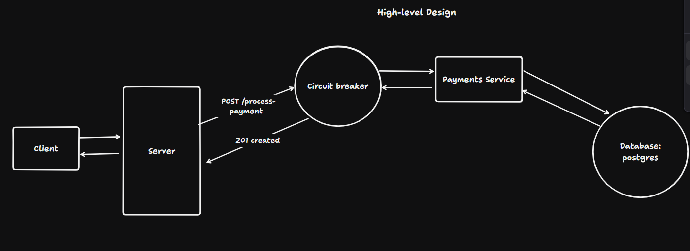

# Idempotency Gateway

A Django + DRF payment-processing gateway that guarantees **exactly-once** semantics on retried client requests and **auto-pauses** when the downstream payment processor goes unhealthy.

## Architecture Diagram

Clients retry payment requests when they don't get a timely response; without protection that retries the charge. This service sits in front of the real payment processor (PSP), dedupes by `Idempotency-Key`, and wraps the downstream call in a circuit breaker so a degrading PSP doesn't cascade into total outage.


<!-- Drop a sequence diagram or flowchart at docs/architecture.png (or update the path above). -->

```
                     POST /api/v1/process-payment
                                 │
                                 ▼
                ┌──────────────────────────────┐
                │ initial(): Idempotency-Key   │── missing ──► 400
                │ header present?              │
                └──────────────────────────────┘
                                 │ yes
                                 ▼
                ┌──────────────────────────────┐
                │ Look up Transaction by       │
                │ idempotency_key              │
                └──────────────────────────────┘
                       │              │
            row found  │              │ no row
                       ▼              ▼
        ┌──────────────────┐    ┌───────────────────┐
        │ payload_hash     │    │ circuit_breaker   │
        │ matches stored?  │    │ .check_or_raise() │
        └──────────────────┘    └───────────────────┘
           │           │              │           │
           │ no        │ yes          │ CLOSED    │ OPEN
           ▼           ▼              │           ▼
          409       201 +             │         503 +
        (fraud)    X-Cache-Hit        ▼       Retry-After
                                processor.process_payment()
                                      │
                            ┌─────────┴─────────┐
                            │                   │
                       success                  error
                            │                   │
                            ▼                   ▼
                   status=COMPLETED      status=FAILED
                   record_success()      record_failure()
                            │                   │
                            ▼                   ▼
                          201                502 (or 500)
```

Two persistent objects live in the database: `Transaction` (one row per idempotent request) and `CircuitBreakerState` (a single-row state machine for the breaker). Both are visible in the Django admin.

## Setup Instructions

Requires Python 3.9+ and [uv](https://docs.astral.sh/uv/) as the package manager.

```bash
uv sync                              # creates .venv and installs deps from pyproject.toml

source .venv/Scripts/activate # use created environment

uv run python manage.py migrate
uv run python manage.py createsuperuser   # optional, for /admin access
uv run python manage.py runserver
```

The API is then available at `http://localhost:8000/api/v1/process-payment` and the admin at `http://localhost:8000/admin/`.

## API Documentation

### `POST /api/v1/process-payment`

**Headers**

| Header             | Required | Notes                                                       |
|--------------------|----------|-------------------------------------------------------------|
| `Idempotency-Key`  | yes      | Any client-chosen string, max 20 chars. Identifies the request. |
| `Content-Type`     | yes      | `application/json`                                          |

**Body**

```json
{
  "amount": "100.00",
  "phone_number": "0244000000",
  "email": "buyer@example.com",
  "full_name": "Ama Mensah",
  "payment_method": "MOMO",
  "currency": "GHS"
}
```

`payment_method` ∈ `{CARD, BANK, MOMO}`; `currency` ∈ `{GHS}`; `amount` is a decimal between `0` and `25000`.

**Example**

```bash
curl -X POST http://localhost:8000/api/v1/process-payment \
  -H "Idempotency-Key: order-abc-123" \
  -H "Content-Type: application/json" \
  -d '{
    "amount": "100.00",
    "phone_number": "0244000000",
    "email": "buyer@example.com",
    "full_name": "Ama Mensah",
    "payment_method": "MOMO",
    "currency": "GHS"
  }'
```
**NB:** Making a request might yield a bad gateway. This is by design. Some requests are randomly made bad to test for the circuit breaker situation. View **[CIRCUIT_BREAKER.md](docs/CIRCUIT_BREAKER.md)** for more information on how it works.

**Responses**

| Status | When | Body / Headers |
|--------|------|----------------|
| `201 Created`              | First successful request | Serialized transaction (`amount`, `phone_number`, `full_name`, `currency`, `status`). |
| `201 Created` + `X-Cache-Hit: True` | Replay of a prior successful request (same key, same body) | Same body as the first response. Processor is **not** called. |
| `400 Bad Request`          | `Idempotency-Key` header missing | `{"Error": "Missing Idempotency-Key"}` |
| `409 Conflict`             | Same key, **different** body (suspected fraud / client bug) | `{"error": "Idempotency key already used for a different request body."}` |
| `502 Bad Gateway`          | Downstream PSP raised `ProcessorError` | `{"detail": "Payment processor error."}` |
| `503 Service Unavailable` + `Retry-After` | Circuit breaker is `OPEN` | `{"error": "Service temporarily unavailable.", "retry_after": <seconds>}` |

## Design Decisions

- **Payload hash uses SHA-256 of `json.dumps(..., sort_keys=True)`** (`payments/utils.py:4-7`). `sort_keys` makes `{"a":1,"b":2}` and `{"b":2,"a":1}` collide so the fraud check doesn't false-positive on key reorder. SHA-256 collision probability is irrelevant at payments traffic volume.
- **`idempotency_key` is the primary key on `Transaction`** (`payments/models.py:26`). Uniqueness is enforced by the DB, no extra unique index needed, and the lookup is a PK seek.
- **Cache hits bypass the breaker** (`payments/views.py:35-49`, before `circuit_breaker.check_or_raise()`). Replays don't touch the PSP, so blocking them while the breaker is open would punish customers for an outage they're not actually triggering.
- **Singleton breaker row + `select_for_update()` inside `transaction.atomic()`** (`payments/circuit_breaker.py`). Multi-worker safe without any external infra (Redis/etcd); single row by convention (`pk=1`) keeps it dead simple.
- **Tumbling (not sliding) counter window.** When `now - window_start >= WINDOW_SECONDS`, counters reset. Simpler and adequate at the timescales that matter (outage detection in tens of seconds).
- **Stub PSP behind a seam** (`payments/processor.py`) is simulated with a `PSP_STUB_FAILURE_RATE` determining when to fail and when to succeed. This can be tweaked in `finsafe_psp/settings.py`. Also, replacing the processor logic with a real PSP integration is a one-file change; the breaker and view contracts stay intact.

## The Developer's Choice: Circuit Breaker

The bonus feature is a **circuit breaker around the downstream payment processor**. When failures spike past a configured threshold, the breaker trips `OPEN`, and `POST /api/v1/process-payment` starts responding with `503 + Retry-After` until a cooldown elapses and a single probe request confirms the dependency has recovered.


The motivation is concrete: in a real Payment Service Provider, failing requests from the system might compound causing a hold up of resources. To prevent this, the circuit breaker detects a pattern of failed request and pauses all requests to the service having issues hence giving ample time for engineers or even the system itself to recover. In other words, the breaker turns a degrading dependency into fast, cheap rejections at the gateway edge hence protecting both customers and the system (no thundering herd at recovery).

See **[CIRCUIT_BREAKER.md](docs/CIRCUIT_BREAKER.md)** for the full state machine, configuration knobs, request-flow diagram, operating procedures, and extension guidance.

### Test the Circuit Breaker
```bash
uv run python simulate.py
```

`simulate.py` fires a burst of bad/good requests at `/api/v1/process-payment` so you can watch the breaker move from `CLOSED` → `OPEN` (subsequent requests return `503` with `Retry-After`) and includes a race-condition scenario that hammers the same idempotency key from many concurrent clients.

## Running tests

```bash
uv run python manage.py test payments
```

11 tests in two groups:

- `TransactionsViewV1Tests` (5) — idempotency, fraud detection, missing header, cache-hit replay.
- `CircuitBreakerTests` (6) — threshold trip, `Retry-After` shape, cached replays bypass `OPEN`, cooldown → `HALF_OPEN` close, `HALF_OPEN` reopen on failure, unexpected exceptions count as failures.

Both groups patch `payments.processor.process_payment` directly to drive deterministic outcomes, so the suite runs in about a second.

For an end-to-end check against a real server, start `runserver` and run the load script:

```bash
uv run python simulate.py
```

`simulate.py` fires a burst of bad/good requests at `/api/v1/process-payment` so you can watch the breaker move from `CLOSED` → `OPEN` (subsequent requests return `503` with `Retry-After`) and includes a race-condition scenario that hammers the same idempotency key from many concurrent clients.

## Project layout

```
.
├── finsafe_psp/            # Django project (settings, root urls)
│   ├── settings.py         # CIRCUIT_BREAKER + PSP_STUB_FAILURE_RATE live here
│   └── urls.py
├── payments/               # The app
│   ├── models.py           # Transaction, CircuitBreakerState
│   ├── serializers.py
│   ├── views.py            # TransactionsViewV1
│   ├── urls.py             # /api/v1/process-payment
│   ├── utils.py            # get_payload_hash
│   ├── processor.py        # Stub downstream PSP
│   ├── circuit_breaker.py  # check_or_raise / record_success / record_failure
│   ├── exceptions.py       # ProcessorError, CircuitOpenError
│   ├── admin.py
│   └── tests.py
├── README.md               # You are here
├── simulate.py             # Load script that trips the breaker against a live server
├── manage.py
└── pyproject.toml
```
